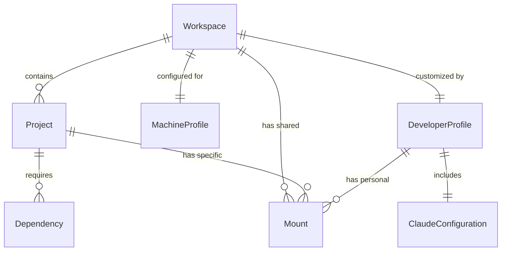

# Data Model: DevContainer Configuration System

## Core Entities

### Workspace
Container environment hosting multiple projects with shared resources and isolated dependencies.

**Fields**:
- `name`: String - Workspace identifier
- `baseImage`: String - Docker base image reference
- `projects`: List<Project> - Associated projects
- `sharedMounts`: List<Mount> - Common volume mounts
- `machineProfile`: MachineProfile - Platform-specific settings
- `developerProfile`: DeveloperProfile - Personal customizations

**Relationships**:
- Has many Projects (1:N)
- Has one MachineProfile (1:1)
- Has one DeveloperProfile (1:1)

**State Transitions**:
- `initialized` → `building` → `running` → `stopped`
- `running` → `rebuilding` → `running`

### Project
Individual development project with its own dependencies and configuration requirements.

**Fields**:
- `name`: String - Project identifier
- `path`: String - Workspace-relative path
- `dependencies`: List<Dependency> - Project-specific dependencies
- `mounts`: List<Mount> - Project-specific volume mounts
- `environment`: Map<String, String> - Environment variables
- `features`: List<String> - DevContainer features to include

**Relationships**:
- Belongs to Workspace (N:1)
- Has many Dependencies (1:N)
- Has many Mounts (1:N)

**Validation Rules**:
- Project name must be unique within workspace
- Path must be valid relative path
- No conflicting dependency versions with other projects

### MachineProfile
Configuration specific to Windows WSL2 host environment.

**Fields**:
- `platform`: Enum [WSL2] - Currently supports Windows WSL2 only
- `dockerHost`: String - Docker daemon connection
- `pathPrefix`: String - Platform-specific path prefix
- `performanceSettings`: Map<String, String> - Platform optimizations
- `capabilities`: List<String> - Required container capabilities

**Relationships**:
- Belongs to Workspace (N:1)

**Validation Rules**:
- Platform must be supported
- Path prefix must follow platform conventions
- Capabilities must be valid Docker capabilities

### DeveloperProfile
Personal customizations and settings separate from core configuration.

**Fields**:
- `userId`: String - Developer identifier
- `customExtensions`: List<String> - Additional VS Code extensions
- `personalMounts`: List<Mount> - User-specific volume mounts
- `preferences`: Map<String, String> - Personal settings
- `claudeConfig`: ClaudeConfiguration - Claude Code settings

**Relationships**:
- Belongs to Workspace (N:1)
- Has one ClaudeConfiguration (1:1)

**Validation Rules**:
- Personal mounts must not conflict with shared mounts
- Extensions must be valid VS Code extension IDs

### ClaudeConfiguration
API keys, settings, and preferences for Claude Code integration.

**Fields**:
- `apiKeyMount`: String - Path to API key file
- `configDir`: String - Claude configuration directory
- `contextFiles`: List<String> - Files to include in Claude context
- `workflowSettings`: Map<String, String> - Claude workflow preferences
- `mcpServers`: List<String> - MCP server configurations

**Relationships**:
- Belongs to DeveloperProfile (N:1)

**Validation Rules**:
- API key mount must be secure (not in version control)
- Config directory must be accessible
- Context files must exist and be readable

### Mount
Volume or bind mount configuration for container storage.

**Fields**:
- `source`: String - Source path or volume name
- `target`: String - Container mount path
- `type`: Enum [bind, volume, tmpfs]
- `consistency`: Enum [cached, delegated, consistent] - WSL2 optimization
- `readonly`: Boolean - Mount read-only flag

**Relationships**:
- Can belong to Workspace (shared mounts)
- Can belong to Project (project-specific mounts)
- Can belong to DeveloperProfile (personal mounts)

**Validation Rules**:
- Source must be valid path or volume name
- Target must be absolute container path
- Type must match source format
- Consistency only applicable to bind mounts

### Dependency
Software dependency requirement for a project.

**Fields**:
- `name`: String - Dependency name
- `version`: String - Version constraint
- `type`: Enum [apt, npm, pip, cargo, gem] - Package manager
- `global`: Boolean - Install globally vs project-specific
- `buildOnly`: Boolean - Required only during build

**Relationships**:
- Belongs to Project (N:1)

**Validation Rules**:
- Version must be valid semantic version constraint
- Type must match dependency ecosystem
- Global dependencies require elevated privileges

## Entity Relationships



## Configuration Schema

The data model maps to DevContainer configuration files as follows:

### devcontainer.json Structure
```json
{
  "name": "${workspace.name}",
  "dockerComposeFile": "docker-compose.yml",
  "service": "devcontainer",
  "mounts": "${workspace.sharedMounts + project.mounts + developer.personalMounts}",
  "customizations": {
    "vscode": {
      "extensions": "${baseExtensions + developer.customExtensions}",
      "settings": "${baseSettings + developer.preferences}"
    }
  },
  "containerEnv": "${project.environment}",
  "features": "${project.features}"
}
```

### Docker Compose Override
Projects can override base configuration through docker-compose.override.yml based on their specific requirements.

## Data Persistence

- **Configuration Files**: Stored in `.devcontainer/` directory structure
- **Personal Settings**: Stored separately from version-controlled files
- **Cache Data**: Named Docker volumes for performance
- **Secrets**: External secret management, not stored in configuration